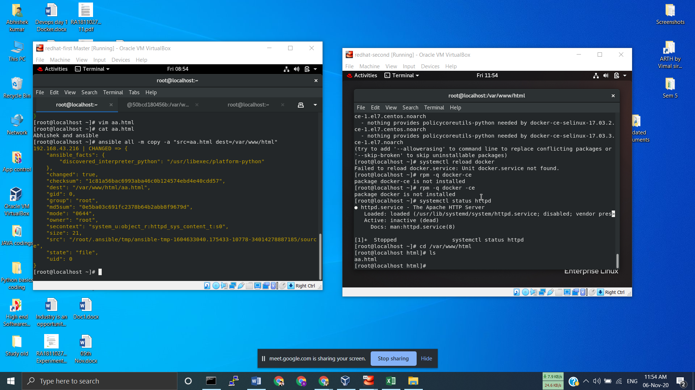

# Ansible-Automation2 #

Its a very basics demo of Ansible.

It helps in a companies, where huge connected systems naads to start services, in each of the 
system.

Eitehr we go manually and run commands and get services
or either we should
have a Shortcut.

In this repository, I have demostrated that how to install httpd,
transfer some files and to start httpd service to the agents those are my target nodes,
from a single system which will be boss's OS 
or technically in Ansible world it is called 
#Control_node#

The control node will control all the commands remotely without manually going to each place.

like a example
i put a picture, that will demostarate how this contol node makes contol over hub.
go to the document attached with this repo.

